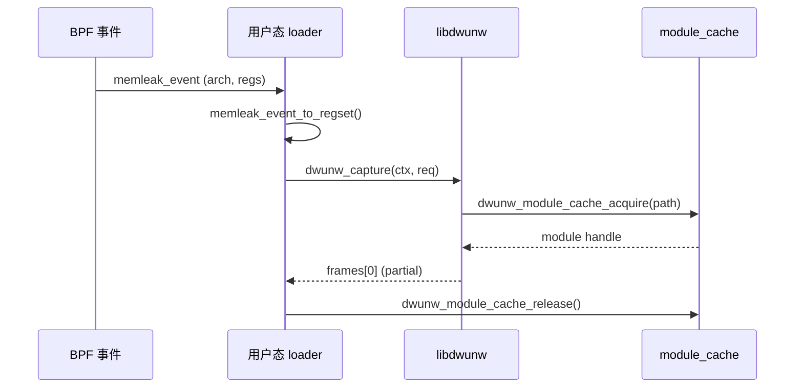

# libdwunw API 使用速查

该文档汇总最常用的调用顺序与约束，便于在 eBPF 采样路径中快速集成。

## 生命周期与模块缓存

1. 在进程启动时分配 `struct dwunw_context`，调用 `dwunw_init()` 完成模块缓存初始化。
2. 每次捕获前检查 `ctx->module_cache_ready`，异常情况下优雅回退。
3. 结束时调用 `dwunw_shutdown()`，该函数会主动 flush 16 槽的 `dwunw_module_cache`，释放所有 ELF/DWARF 句柄。

> **注意**：模块缓存不是线程安全的。如果在多线程/多 CPU 事件处理器上使用，需要在调用 `dwunw_capture()` 前加锁或实现更高层的串行化。

## 寄存器窗口准备

- 使用 `dwunw_regset_prepare(&regs, arch_id)` 创建一个与目标架构匹配的快照，并写入 `regs.pc`、`regs.sp` 等基础字段。
- eBPF 事件与 `dwunw_regset` 的转换建议集中在一个 helper（示例：`memleak_event_to_regset()`）。
- `version` 字段必须保持 `DWUNW_REGSET_VERSION`，否则 `dwunw_arch_from_regset()` 会返回 `NULL`。

## 捕获流程

- `struct dwunw_unwind_request` 在构造时应显式清零；当希望展开多帧时，必须提供 `read_memory`/`memory_ctx`，用于按地址读取父帧栈槽。回调的语义与 `pread()` 类似：若地址超界应返回 `DWUNW_ERR_INVALID_ARG`。
- `dwunw_capture()` 默认只会产生首帧，并以 `DWUNW_FRAME_FLAG_PARTIAL` 标记；当 DWARF CFI 与 `read_memory` 同时可用时，会自动继续展开，直到命中 FDE 终止或 `max_frames` 上限。
- 任何阶段失败都会返回 `dwunw_status_t` 错误码；调用方应根据 `DWUNW_ERR_NO_DEBUG_DATA`、`DWUNW_ERR_IO` 等类型决定回退策略。

## 常见错误处理

| 错误码 | 场景 | 建议回退 |
| --- | --- | --- |
| `DWUNW_ERR_NO_DEBUG_DATA` | ELF 缺少 `.debug_info`/`.eh_frame` | 转用 FP unwinder 或跳过事件 |
| `DWUNW_ERR_CACHE_FULL` | 同时打开超过 16 个模块 | 在调用前主动 release 冷门模块，或扩容 `DWUNW_MODULE_CACHE_CAPACITY` |
| `DWUNW_ERR_UNSUPPORTED_ARCH` | `arch_id` 不在注册表中 | 检查事件侧是否正确设置 `arch` | 

## 性能/内存提示

- `dwunw_elf_open()` 会一次性 mmap/复制整个 ELF 文件，建议在控制面的模块集合内复用；不要对短期临时路径重复打开。
- 将 `memleak_event` 放置在 BPF ring buffer 时，应复用静态缓冲区，避免在热路径中频繁 `memcpy`。
- 建议在处理每 N 次 unwinding 后调用 `dwunw_module_cache_flush()`（例如重新部署时），防止旧版本 ELF 持续驻留内存。
