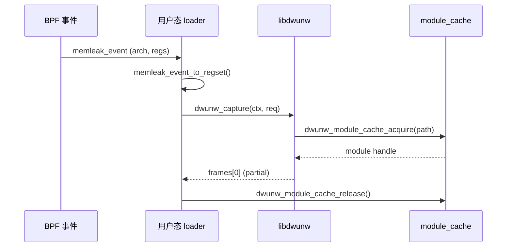

# libdwunw API 使用速查

该文档汇总最常用的调用顺序与约束，便于在 eBPF 采样路径中快速集成。

## 生命周期与模块缓存

1. 在进程启动时分配 `struct dwunw_context`，调用 `dwunw_init()` 完成模块缓存初始化。
2. 每次捕获前检查 `ctx->module_cache_ready`，异常情况下优雅回退。
3. 结束时调用 `dwunw_shutdown()`，该函数会主动 flush 16 槽的 `dwunw_module_cache`，释放所有 ELF/DWARF 句柄。

- `dwunw_module_cache_release()` 现在只会把槽位标记为“温存”（`refcnt==0` 但 ELF/DWARF 仍驻留），后续再次 `acquire` 相同路径时无需重新解析；只有当 16 个槽都已被活跃/温存条目占满且需要新模块时，库才会选择最老的温存槽并真正关闭其 ELF/DWARF。

> **注意**：模块缓存不是线程安全的。如果在多线程/多 CPU 事件处理器上使用，需要在调用 `dwunw_capture()` 前加锁或实现更高层的串行化。

## 寄存器窗口准备

- 使用 `dwunw_regset_prepare(&regs, arch_id)` 创建一个与目标架构匹配的快照，并写入 `regs.pc`、`regs.sp` 等基础字段。
- eBPF 事件与 `dwunw_regset` 的转换建议集中在一个 helper（示例：`memleak_event_to_regset()`）。
- `version` 字段必须保持 `DWUNW_REGSET_VERSION`，否则 `dwunw_arch_from_regset()` 会返回 `NULL`。

## 捕获流程

- `struct dwunw_unwind_request` 在构造时应显式清零；当希望展开多帧时，设置 `pid`/`tid` 以启用库内默认 helper（`ptrace + process_vm_readv + /proc/<pid>/mem`）。
- `dwunw_capture()` 默认只会产生首帧，并以 `DWUNW_FRAME_FLAG_PARTIAL` 标记；当 DWARF CFI 与默认 reader 均可用时，会自动继续展开，直到命中 FDE 终止或 `max_frames` 上限。
- 任何阶段失败都会返回 `dwunw_status_t` 错误码；调用方应根据 `DWUNW_ERR_NO_DEBUG_DATA`、`DWUNW_ERR_IO` 等类型决定回退策略。

## 多帧展开与回退

1. 当调用者需要完整 DWARF 栈时，只需在 `dwunw_unwind_request` 中写入 `pid`（必填）和 `tid`（可选，默认为 `pid`）。`dwunw_capture()` 会在内部执行 `ptrace_attach → process_vm_readv → /proc/<pid>/mem` 的链式尝试，调用方无需也不能自定义 reader。
2. 若默认 helper 在 attach/读取阶段失败（例如缺少 `CAP_SYS_PTRACE`、目标已退出），`dwunw_capture()` 会返回 `DWUNW_ERR_IO` 等错误码。调用方可在“回退模式”下将 `pid/tid` 重置为 0 并重试，以获得单帧输出；当 CLI 处于“强制模式”时，可直接将错误表面化，避免静默丢帧。
3. `dwunw_capture()` 在检测到默认 reader 不可用、读取失败或 FDE 缺口时，会将最后一帧标记为 `DWUNW_FRAME_FLAG_PARTIAL`；调用者可据此提示“回退至帧 #0”，以便后续排查。
4. 建议在日志中输出 reader 来源（`/proc/<pid>/mem`、core dump 等）与错误码，避免与 DWARF 解析失败混淆；测试过程中可通过向 reader 注入 `DWUNW_ERR_INVALID_ARG` 来模拟边界地址。

> 提示：多帧展开通常需要额外权限（`CAP_SYS_PTRACE` 或 ptrace attach），在容器化环境运行时应提前确认安全策略，必要时在 CLI 中提供 `--allow-mem-reader` 开关，由操作者显式授权。

## 常见错误处理

| 错误码 | 场景 | 建议回退 |
| --- | --- | --- |
| `DWUNW_ERR_NO_DEBUG_DATA` | ELF 缺少 `.debug_info`/`.eh_frame` | 转用 FP unwinder 或跳过事件 |
| `DWUNW_ERR_CACHE_FULL` | 16 个槽全部处于“活跃”状态，且无温存槽可回收 | 迁移部分请求到新 `dwunw_context` 或扩容 `DWUNW_MODULE_CACHE_CAPACITY`；确保调用方及时 `release` 以触发温存 |
| `DWUNW_ERR_UNSUPPORTED_ARCH` | `arch_id` 不在注册表中 | 检查事件侧是否正确设置 `arch` | 

## 性能/内存提示

- `dwunw_elf_open()` 会一次性 mmap/复制整个 ELF 文件，建议在控制面的模块集合内复用；不要对短期临时路径重复打开。
- 温存槽会常驻 ELF/DWARF 映像，只有在缓存压力下才回收；若需要腾出内存，可显式调用 `dwunw_module_cache_flush()` 或重新初始化上下文。
- 将 `memleak_event` 放置在 BPF ring buffer 时，应复用静态缓冲区，避免在热路径中频繁 `memcpy`。
- 建议在处理每 N 次 unwinding 后调用 `dwunw_module_cache_flush()`（例如重新部署时），防止旧版本 ELF 持续驻留内存。
