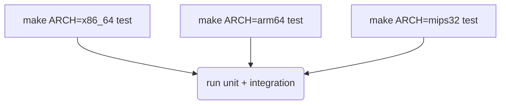

# 跨架构构建与验证指南

该指南总结 Stage 6/7 之后对 x86_64、arm64、mips32 的构建、测试与 DWARF 资产准备要求，方便后续代理直接按矩阵验证。

## 工具链与编译

| ARCH | CROSS_COMPILE 示例 | 备注 |
| --- | --- | --- |
| x86_64 | 留空（默认 gcc） | 主机环境直接使用本地 gcc/clang |
| arm64 | `aarch64-linux-gnu-` | Ubuntu 可通过 `apt install gcc-aarch64-linux-gnu` 获取 |
| mips32 | `mipsel-linux-gnu-` | 需启用 Debian cross repo；确保 `ld.mipsel` 可访问 |

- 通用命令：`make ARCH=<arch> CROSS_COMPILE=<prefix> all`
- `DWUNW_ARCH_CFLAGS_<arch>` 会自动注入 `-DDWUNW_TARGET_<ARCH>` 宏，新增架构时仅需在 `mk/toolchain.mk` 中扩展即可。

## 测试矩阵

- `make test` 现在会执行单元测试（`tests/unit`）与集成测试（`tests/integration`）。
- 运行前会自动构建 `tests/fixtures/dwarf_fixture`，并通过 `DWUNW_TEST_FIXTURE` 传递给所有测试程序。
- 集成测试依赖 `memleak_events.h`，因此 `examples/bpf_memleak` 目录必须在仓库根目录存在。

## DWARF 资产准备

1. 对生产二进制执行 `eu-strip --strip-debug` 之前，先备份 `.debug` 文件，供 `dwunw_module_cache` 使用。
2. 若产物没有调试段，可通过 `objcopy --only-keep-debug` 生成 `.debug` 文件，并在运行时通过 `DWUNW_MODULE_CACHE` 指定真实路径。
3. CI 中可直接使用 `tests/fixtures/dwarf_fixture.c` 生成的小型 ELF，验证基础路径。

## 性能/内存验证

- 在 Release 构建中启用 `-O2 -DNDEBUG`，使用 `perf stat` 包裹 `tests/integration/test_capture_memleak`，确保单次 `dwunw_capture` < 5µs。
- 使用 `valgrind --tool=massif` 检查模块缓存泄漏，重点关注 `dwunw_module_cache_acquire` 未 release 的分支。
- 对 arm64/mips32 交叉环境，可使用 `qemu-<arch>` 运行 `build/<arch>/tests/...` 二进制，结合 `DWUNW_TEST_FIXTURE` 生成对应 ELF。

## 文档与回归记录

- 每次新增架构或修改测试矩阵后，请同步更新本文件和 `doc/api_usage.md`。
- 如果需要引入新的工具链依赖（如 musl-gcc），请在 `doc/toolchain.md`（若新增）中描述安装步骤，并在 PR 描述里附带验证日志。
