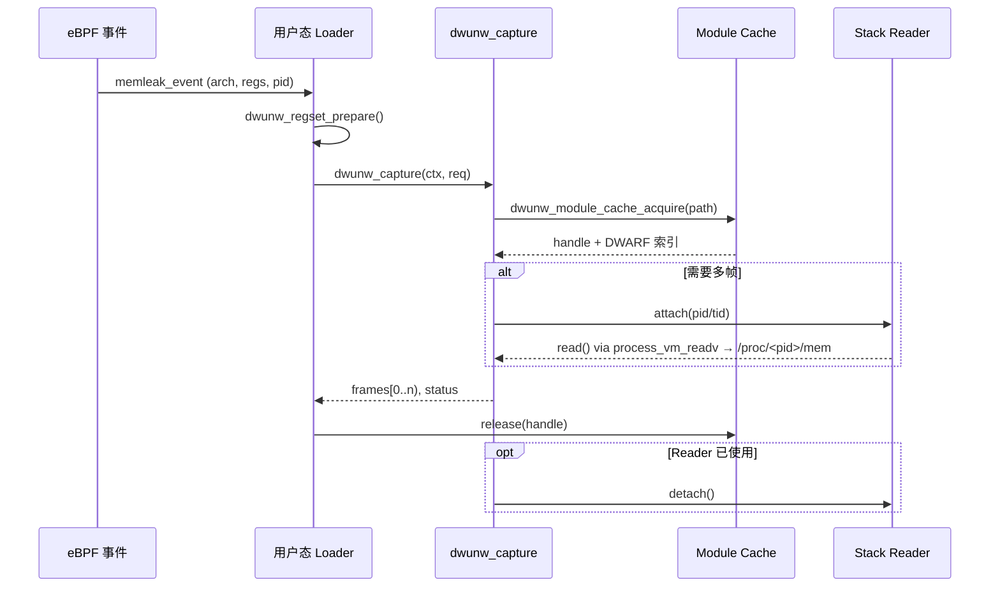
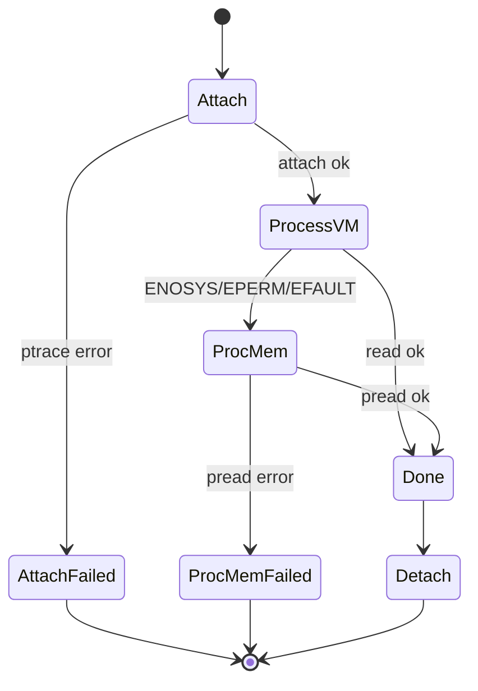

# DWUNW 设计总览

> 文档目的：帮助维护者与集成方快速理解 `libdwunw` 的设计理念、关键模块、核心数据流以及扩展策略，便于在 eBPF 采样链路中安全复用或定制该库。

## 1. 设计理念

- **DWARF 优先**：充分依赖 DWARF 调试信息完成跨架构栈展开，避免硬编码架构细节，保证移植性。
- **分层解耦**：`core` 管理生命周期与上下文，`dwarf` 负责 ELF/DWARF 解析，`arch` 抽象寄存器窗口，`unwinder` 组合上述能力实现回溯，`utils` 则承载与平台相关的附属能力（如栈读取 helper）。
- **面向嵌入**：以静态库形式提供，只有 libc/syscall 依赖，适配最小化的 eBPF loader 或 agent。
- **可回退策略**：任何阶段失败都以 `dwunw_status_t` 精确描述，调用方可选择单帧降级、FP unwinder 或直接忽略。

## 2. 使用技术

| 技术 | 用途 |
| --- | --- |
| C11 + GNU Make | 主体实现与构建系统，支持 `ARCH=x86_64|arm64|mips32` |
| ELF/DWARF 解析 | 自研 `dwunw_elf_load_image`、`dwunw_dwarf_index`、`dwunw_cfi_eval` 解析 `.eh_frame/.debug_frame` |
| ptrace + process_vm_readv | `utils/stack_reader` 默认 helper，通过多级回退读取目标进程栈 |
| libbpf | 示例 (`examples/bpf_memleak`, `examples/memleak_bcc_dwunw`) 以 ring buffer 方式从内核获取采样事件 |
| 单元/集成测试 | `tests/unit/*`, `tests/integration/test_capture_memleak` 验证模块、数据流与 eBPF 事件接入链路 |

## 3. 目录与模块

| 目录 | 职责 |
| --- | --- |
| `include/dwunw/` | 对外头文件，定义 API、状态码、寄存器/帧结构、栈读取接口 |
| `src/core/` | 上下文初始化、架构注册、全局配置 (`dwunw_init`, `dwunw_shutdown`, `dwunw_regset_prepare`) |
| `src/dwarf/` | ELF 映像加载、调试段索引、CFI 执行与 FDE 查找 |
| `src/arch/<arch>/` | 各架构 `dwunw_arch_ops` 实现（CFA 计算、返回地址读取、寄存器标准化） |
| `src/unwinder/` | `dwunw_capture` 主流程，驱动模块缓存、CFI、栈读取 |
| `src/utils/` | 平台辅助模块，目前为 `stack_reader` 默认栈读取 helper |
| `examples/` | eBPF memleak 示例：`bpf_memleak`（纯 libbpf）与 `memleak_bcc_dwunw`（bcc 扩展示例） |
| `tests/` | 单元与集成测试，覆盖核心能力与 memleak 事件链路 |
| `doc/` | API 使用、交叉验证以及本文档等资料 |

## 4. 关键数据结构

| 结构体 | 说明 |
| --- | --- |
| `struct dwunw_context` | 库实例状态，包含 ABI 标记、模块缓存、栈读取器等，可在多线程场景外复用 |
| `struct dwunw_module_cache` | 固定 16 槽 LRU cache，缓存 ELF/DWARF 句柄，需要 `acquire/release` 成对使用 |
| `struct dwunw_regset` | 标准化的寄存器窗口，包含 `pc/sp`、版本号与架构标签，由 `dwunw_regset_prepare` 初始化 |
| `struct dwunw_unwind_request` | 一次回溯请求，包含目标模块路径、寄存器快照、帧数组、选项、`pid/tid` 以及可选自定义 reader |
| `struct dwunw_frame` | 回溯结果，记录 `pc/sp/cfa/ra`、模块路径及标记位（如 `DWUNW_FRAME_FLAG_PARTIAL`） |
| `struct dwunw_stack_reader` + `session` | 默认栈读取器上下文，封装 ptrace attach、`process_vm_readv`/`/proc/<pid>/mem` 访问与资源回收 |
| `struct dwunw_fde_record` | DWARF FDE 索引条目，缓存 CIE/FDE 指针、PC 范围及编解码参数 |

## 5. 回溯流程

## 6. 栈读取回退流程

- `AttachFailed`：`dwunw_capture` 会返回错误并保持单帧；调用方可清空 `pid/tid` 重试。
- `ProcMemFailed`：返回 `DWUNW_ERR_IO`，示例默认在 fallback 模式下降级。

## 7. 关键数据流

| 阶段 | 输入 | 输出 | 关键函数 |
| --- | --- | --- | --- |
| 事件转换 | eBPF `memleak_event` | `dwunw_regset` | `memleak_event_to_regset` |
| 模块缓存 | ELF 路径 | `dwunw_module_handle` | `dwunw_module_cache_acquire/release` |
| CFI 执行 | CIE/FDE, 寄存器窗口 | 新帧 + 更新寄存器 | `dwunw_cfi_eval` |
| 栈读取 | `pid/tid`, 地址范围 | 字节缓冲区 | `dwunw_stack_reader_read` |
| 回溯 orchestrator | Request + Context | 帧数组、状态码 | `dwunw_capture` |

## 8. 扩展指南

1. **新增架构**
   - 在 `include/dwunw/arch_ops.h` 注册 ID。
   - 实现 `src/arch/<arch>/arch_ops.c` 的 `normalize/compute_cfa/read_return_addr/open_frame`。
   - 在 `tests/unit/test_arch_ops.c` 增加对应用例。

2. **增量特性**
   - **CFI 扩展**：在 `src/dwarf/cfi.c` 中添加新的 DWARF opcode 支持，并在 `tests/unit/test_cfi.c` 增加合成样例。
   - **缓存策略**：若需要超过 16 个模块，可调整 `DWUNW_MODULE_CACHE_CAPACITY` 并增加 LRU 算法测试。

3. **默认 reader 定制**
   - 如需自定义栈访问方式，可在 `dwunw_unwind_request` 中提供 `read_memory`/`memory_ctx` 覆盖默认 helper；或扩展 `dwunw_stack_reader` 以支持远程采样。

4. **多线程/多实例**
   - 目前上下文/缓存未加锁；若需要并发访问，请在外层序列化或引入新的线程安全包装层。

## 9. 使用与集成指南

1. **生命周期**
   - 调用 `dwunw_init(&ctx)`；若返回非 `DWUNW_OK`，检查工具链或内存配置。
   - 捕获结束后调用 `dwunw_shutdown(&ctx)` 释放缓存与 reader。

2. **请求构造**
   - `memset(&req, 0, sizeof(req))`；设置 `module_path`, `regs`, `frames`, `max_frames`。
   - 若希望自动多帧：设置 `req.pid = target_pid; req.tid = maybe_tid;` 并将 `max_frames > 1`。
   - 若需自定义 reader：提供 `req.read_memory` 与 `req.memory_ctx`，库将跳过默认 helper。

3. **错误处理**
   - `DWUNW_ERR_NO_DEBUG_DATA`：模块缺少 CFI，可回退至 FP unwinder。
   - `DWUNW_ERR_IO`：多为 reader 权限/地址问题，示例默认降级到单帧。
   - `DWUNW_ERR_CACHE_FULL`：释放不常用模块或提升缓存容量。

4. **示例路径**
   - `make examples` 构建 `memleak_user` 与 `memleak_dwunw_user`。
   - 运行前确保已授予 `CAP_SYS_PTRACE` 或使用 root。

## 10. 测试与验证

- `make test`：构建静态库与所有单元/集成测试，验证 core/dwarf/arch/unwinder 主功能。
- `DWUNW_TEST_FIXTURE`：指向带 DWARF 的 ELF 样例，供 `tests/unit/test_unwinder` 使用。
- 示例场景：运行 `examples/bpf_memleak/memleak_user`，观察 `frames` 长度与日志中的 reader 状态。

## 11. 未来方向

- **DWARF-less fallback**：在缺少调试符号的环境提供 FP/heuristics 支持。
- **远程采样**：通过 IPC/agent 拉取栈快照，减少 ptrace 带来的安全策略限制。
- **观测指标**：在 reader、模块缓存中增加可选的统计/日志接口，辅助线上排障。

---

如需进一步了解 API 细节，请参阅 `doc/api_usage.md`；若扩展 eBPF 集成，可参考 `examples/` 与 `plans/2025-12-01-dwarf-ebpf-stack-unwinder.md` 的阶段描述。
