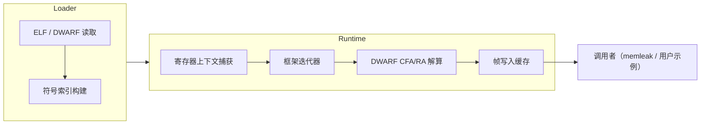

# DWARF eBPF 栈回溯库规范

## 背景
- 以 `ghostscope` 与 `parca` 工程为参考，实现一个面向 eBPF 的 DWARF 栈回溯能力，解决基于 frame pointer 的传统栈追踪在 glibc 优化、不同 ABI 以及 O0 以外编译场景下失效的问题。
- 该库需成为 `bcc-v0.32.0/libbpf-tools` 中 `memleak` 工具的可选/默认依赖，在 glibc 移除 frame pointer 时仍能打印可靠的调用栈。
- 项目交付形态定位为 "可链接静态库 + 示例代码"，便于后续移植到其他 eBPF 工具链或可观测性平台。

## 参考项目的内核/用户态交互模式
- `ghostscope`（参见 `src/ref/ghostscope/docs/architecture.md`）采用 **内核最小化采集 + 用户态解析**：eBPF uprobe 仅负责收集寄存器、内存与 DWARF 定位所需元数据，并经 `bpf_ringbuf_output()` 写入 per-CPU ring buffer；用户态 Trace Manager 内存映射 ring buffer、以流式解析协议消息，再交给 DWARF 解析器重建调用栈和变量，这证明无需改内核即可完成高频交互。
- `parca`（`src/ref/parca/README.md`）的 Parca Agent 设计为用户态守护进程：借助 eBPF profiler 自动发现 systemd/Kubernetes 目标，保持 0 仪表化；采样数据通过 agent 汇集并以 gRPC/pprof 形式上传至 Parca 服务器，体现了“内核负责事件捕获，用户态负责 DWARF/Symbol 处理和上送”的分层思路。

## 目标
1. 提供一个可静态链接的 C 语言库，暴露 DWARF 栈回溯 API，定位在用户态运行，通过已存在的 eBPF 事件通道（例如 perf buffer、ring buffer）与内核交互，不在内核空间部署或修改代码。
2. 支持 x86_64、arm64、mips32（以及后续扩展）等架构，允许以可插拔方式新增后端。
3. 提供 eBPF 采集路径示例：参考 `src/ref/ghostscope/docs/architecture.md` 的模式，由 BPF 程序在内核态采集寄存器/内存快照并通过 `bpf_ringbuf_output()`（或 perf buffer）推送事件，用户态守护程序在 ring buffer 上轮询并调用本库还原调用栈，覆盖 glibc `-fomit-frame-pointer` 等真实场景。
4. 以最少改动集成进 `libbpf-tools/memleak`，可在未开启 frame pointer 的二进制上输出完整调用栈。
5. 面向大规模替换场景，API 设计需稳定、可版本化，并能在 libbpf-tools 中取代依赖 frame pointer 的逻辑。

## 非目标
- 不尝试复刻 `ghostscope`、`parca` 的全部功能，仅抽取满足 eBPF 栈回溯需求的子集。
- 不提供动态链接库（.so）；后续如需可在计划阶段重新评估。
- 不在内核态编译/加载本库，也不修改内核源代码；参照 `ghostscope`、`parca` 的方式完全在用户空间完成解析与栈回溯。
- 不实现完整的 DWARF 生成/写入功能，仅消费 DWARF 信息。

## 交付内容
- `libdwunw.a`（暂定命名）：
  - 初始化/清理接口、符号与 DWARF 元数据加载接口、栈回溯接口。
  - 平台抽象层：寄存器上下文、调用约定、地址空间适配。
  - 错误码体系（对齐 `ghostscope` 的精细错误上报思路），便于调用方判定异常原因并做降级。
- 示例目录：
  - `examples/bpf_memleak/`：以 `src/ref/bcc/libbpf-tools/memleak` 为蓝本，给出最小改动补丁，演示如何在 uprobe eBPF 程序中打包寄存器/栈快照，经 ring buffer 回送用户态并调用本库解析。
- 设计与使用文档（中文），位于 `doc/`：
  - API 参考、内存布局、配置项；
  - 构建指令（含交叉编译）与调试提示；
  - 参照 `ghostscope/docs/architecture.md` 与 `parca/README.md` 的交互流程示意图。

## 功能需求
### API 契约（初稿）
- `int dwunw_init(struct dwunw_ctx *ctx, const struct dwunw_config *cfg);`
  - 负责加载 DWARF/ELF 元数据，建立符号索引，可接受用户提供的 ELF 缓冲或路径。
- `int dwunw_capture(struct dwunw_ctx *ctx, const struct dwunw_regs *regs, struct dwunw_frame *frames, size_t *frame_cnt);`
  - 输入寄存器快照与可写帧缓存，输出回溯链，需支持非阻塞/可重入使用。
- `void dwunw_shutdown(struct dwunw_ctx *ctx);`
  - 清理内部资源，供长期驻留的 eBPF 工具在退出时调用。
- 错误码：统一 `#define DWUNW_ERR_*`，覆盖 DWARF 缺失、架构不支持、内存不足、数据损坏等场景。

### DWARF & ELF 处理
- 支持最常见的 DWARF v4/v5 信息段（`.debug_info`, `.debug_frame`, `.eh_frame`）。
- 解析需要以流式方式进行，避免在热路径上做大规模堆分配；允许使用预分配缓存或调用方提供的 allocator。
- 需要区分用户态与内核态地址空间：
  - 用户态：直接映射进程的 ELF/DWARF。
  - 内核态：通过 BPF 辅助设施或外部守护进程提供的符号文件。

### 平台/ABI 支持
- x86_64：首批实现，兼顾 SysV 与 GNU 属性。
- arm64：支持 AAPCS64，考虑内核与用户态差异。
- mips32：优先 MIPS32r2+ 小端 ABI。
- 架构特定逻辑需封装在 `src/arch/<arch>/`，通过统一的 `struct dwunw_arch_ops` 调用。

### 栈内存访问策略（参考 Ghostscope）
1. 用户态在拿到 eBPF 事件中的寄存器快照后，必须先对目标线程执行 `ptrace(PTRACE_ATTACH)` / `PTRACE_INTERRUPT` 以冻结执行，确保寄存器与栈内容一致，再在处理完堆栈后 `PTRACE_DETACH` 恢复。
2. 栈槽读取首选 `process_vm_readv()`：
  - 单次调用可批量复制多个连续/不连续区域，减少 `/proc/<pid>/mem` 所需的反复 `lseek+read`；
  - 需要 `CAP_SYS_PTRACE` 或已 attach 的 ptrace 权限，按 Ghostscope 的守护流程实现；
  - 错误码（如 `ENOSYS`、`EPERM`、`EFAULT`）需回传给 `dwunw_capture`，调用方再决定是否降级。
3. 当 `process_vm_readv` 不可用（内核未启用、权限不足、seccomp 拦截等）时，回退到 `/proc/<pid>/mem` 读取：
  - reader 由库内部全权管理，对外不再暴露自定义注册接口；
  - 读取失败或偏移越界返回 `DWUNW_ERR_IO`/`DWUNW_ERR_INVALID_ARG`，库层会继续输出部分帧。
4. 栈读取接口面向 eBPF 场景提供默认实现：库提供 `process_vm_readv` + `/proc/<pid>/mem` 双路径 reader，并作为唯一推荐实现；规范明确禁止调用方覆盖或注册自定义 reader，以降低集成复杂度。
5. 安全性要求：
  - 禁止长期持有 `/proc/<pid>/mem` FD，逐事件打开/关闭；
  - 记录 attach/detach 行为的审计日志，帮助排查意外阻塞；
  - 对不可暂停的进程（如设置了 `PR_SET_DUMPABLE=0`）必须在 CLI 层显式告警，防止静默丢帧。
6. 为了降低调用方的重复实现成本，库层需在 `src/utils/stack_reader.*` 形式提供一个“默认启用”的 helper：
  - API 暴露 `dwunw_stack_reader_{init,attach,read,detach}`，内部实现 `ptrace + process_vm_readv + /proc/<pid>/mem` 组合流程；
  - 默认情况下，`dwunw_capture` 必须自动使用该 helper，不允许调用方覆写 reader 逻辑；
  - 若未来扩展到非 eBPF 场景再评估是否重新开放自定义 reader，本阶段视为不支持。

## 性能与健壮性要求
- 热路径（栈回溯循环）禁止重复 malloc/free；需复用调用方提供的帧缓存。
- 单次回溯必须在 <5µs（x86_64 服务器级 CPU）内完成，才能满足高频采样和 memleak 扫描需求。
- 对 DWARF 缺失或损坏情况要给出可诊断错误，并允许调用方降级处理（例如返回部分帧）。

### 模块缓存策略（新增要求）
- 模块缓存容量维持 16 槽不变，但语义改为“双态”：
  - **活跃槽**：`refcnt > 0`，表示正在被某次回溯使用。
  - **温存槽**：`refcnt == 0`，但仍保留 ELF 映像与解析完的 DWARF 索引，只将状态标记为“空闲可复用”。
- 当命中同一路径且有温存槽存在时，直接重用该槽并把 `refcnt` 提升回 1，避免重复打开/解析 DWARF，大幅降低单进程反复采样的开销。
- 只有在缓存满且需要装入新的模块路径时，才从温存槽中选择一个回收（策略暂按 FIFO/最早释放顺序即可，后续可扩展为 LRU）；被回收的槽此时才真正关闭 ELF、释放 DWARF 索引、清空路径。
- 若所有槽都处于活跃状态但仍需装入新模块，应返回 `DWUNW_ERR_CACHE_FULL`，保持与既有错误语义一致。
- 该行为必须记录在 `doc/api_usage.md` 与 `doc/dwunw_design.md`，提示调用方：无需手动 pin 句柄也能享受热缓存收益，但仍需调用 `dwunw_module_cache_release()` 以便槽位转入温存态并可复用。

## 架构概览

## 与 libbpf-tools/memleak 的集成
- 由 `memleak` 在采样到可疑对象后调用 `dwunw_capture` 获取调用栈。
- 若 `dwunw_capture` 返回 `DWUNW_ERR_UNSUPPORTED_ARCH` 等错误，`memleak` 可回退到原有 frame pointer 流程。
- 需要在 `memleak` 构建系统中新增 `libdwunw.a` 作为依赖，并提供探测宏（如 `HAVE_DWUNW`）。

## 测试与验证
- 单元测试：
  - 针对 DWARF 解析、CFA 计算、寄存器映射的纯 C 测试，位于 `tests/unit/`。
- 集成测试：
  - 基于真实 ELF 样例（包含 x86_64/arm64/mips32）执行回溯，校验帧序列。
  - 与 `memleak` 工具联调，比较 frame pointer 与 DWARF 路径的调用栈。
- 输出需包含期望/实际堆栈并给出差异总结，方便 CI 审阅。

## 验收标准
- 在 x86_64 上，`memleak` 使用本库即可在 `-fomit-frame-pointer` 的 glibc 场景下打印 ≥90% 的完整调用栈（以函数层级计）。
- arm64、mips32 样例能够成功编译并运行提供的示例，输出正确的栈信息。
- API 与错误码经文档化，示例可以作为集成参考直接复用。

## 风险与缓解
- **DWARF 解析复杂度高**：采用模块化架构并对照 `ghostscope`、`parca` 的实现验证边界条件。
- **跨架构寄存器差异**：以 `struct dwunw_arch_ops` 抽象寄存器访问，并为新架构编写独立测试。
- **与 eBPF 上下文交互受限**：在内核态示例中说明如何通过辅助程序或用户态守护进程提供 DWARF 数据，确保可行性。

