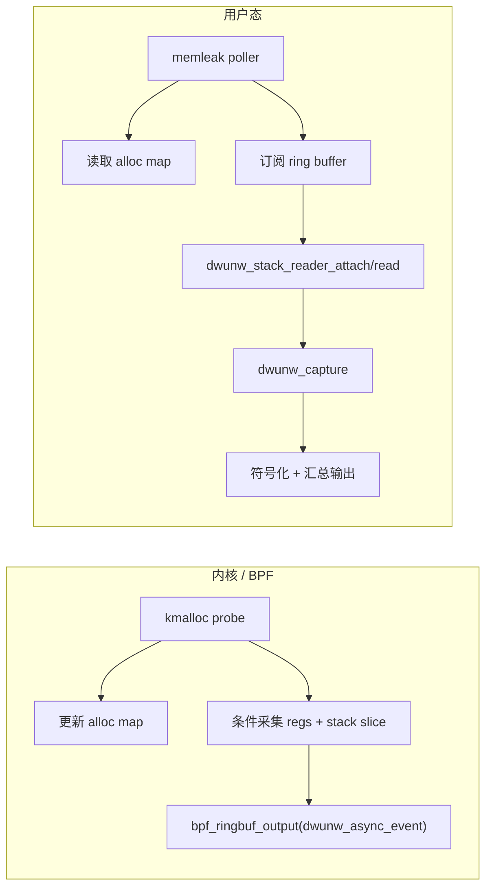

# memleak 内核态异步计数与用户态 DWARF 回溯兼容性规范

## 背景与问题陈述
- `libbpf-tools/memleak` 的内核态 BPF 程序通过 tracepoint/kprobe 在对象分配与释放时更新 BPF map，最终由用户态读取聚合后的泄漏统计；整个过程是 **内核异步采样 + 用户态延迟展示**，用户态并不会在事件发生的瞬间参与。
- 本仓库计划的 DWARF 回溯库完全驻留在用户态，仅能在拿到寄存器/栈上下文后才能解算调用栈，与 memleak 目前“内核态即刻统计、用户态只看累积结果”的模型存在接口缺口。
- 本规范阐明：在保持 memleak 核心异步架构不变的前提下，通过最小扩展的事件管道将 **可回溯的上下文元数据**（PC、SP、寄存器快照或堆栈片段）送达用户态，使 `dwunw_*` API 能在用户态补全 DWARF 信息，从而证明项目目标可实现。

## 目标
1. 定义一套可移植的 **BPF → 用户态 事件结构**，在不阻塞内核热路径的情况下携带进行 DWARF 回溯所需的最小上下文。
2. 指定用户态守护进程（memleak user）在收到事件后如何按需调用 `dwunw_stack_reader` + `dwunw_capture` 执行延迟回溯，确保与异步统计流程兼容。
3. 证明无需在内核态解析 DWARF，也不需要同步阻塞地等待用户态反馈，即可通过“异步采集 + 用户态回溯”恢复完整调用链。
4. 给出验收判据，保证架构落地后在真实 `-fomit-frame-pointer` 场景下可稳定输出 ≥90% 完整调用栈。

## 非目标
- 不在内核态部署 DWARF 解析或复杂符号化逻辑。
- 不改变 memleak 现有的 BPF map 计数/聚合语义；仅新增必要的辅助事件通道。
- 不一次性实现所有 CPU 架构的 BPF 程序，优先以 x86_64 作为样板，其它架构按需补齐。

## 当前行为摘要
1. BPF 程序拦截 `kmalloc`/`kfree`/`__kmalloc_track_caller` 等路径，记录 `struct alloc_info { u64 address; u64 size; u64 caller; }` 并维护哈希映射。此 `caller` 为内核获取的指令地址，缺乏用户态可直接消费的完整栈。
2. 用户态定期以 `bpf_map_lookup_batch` 拉取仍未释放的对象，按地址桶聚合后打印“size/allocs/caller”。
3. 整个流程中用户态仅拿到一个地址（或栈ID），缺失寄存器窗口、SP/FP、原始线程信息，无法直接调用 DWARF 回溯。

## 需求与约束
### 功能需求
- **事件扩展**：
  - 新增 ring buffer（或复用现有 perf buffer）条目 `struct dwunw_async_event`，字段至少包括 `tgid/pid`, `tid`, `alloc_id`, `timestamp`, `ip`, `sp`, `stack_bytes[DWUNW_CAPTURE_SLICE]`, `regs_snapshot[DWUNW_MAX_ARCH_REGS]`, `flags`。
  - BPF 热路径仅负责采样固定大小的栈切片与常用寄存器（IP、SP、BP、FP、LR、CFA hints），禁止循环扫描，避免 O(n) 负担。
  - 若 BPF helper 不允许直接读用户栈，可退化为仅上传 `ip` + `stackid`，由用户态 `dwunw_stack_reader` 结合 `ptrace + process_vm_readv` 在事件消费阶段再补齐真正的栈内容。
- **事件过滤/抽样**：为避免 ring buffer 洪泛，需支持：
  - 仅在“对象未释放达到阈值”时，将对应分配事件推送到用户态；
  - 或者在用户态识别热点 bucket 后，通过 `bpf_map_update_elem(trigger_map)` 设置 PID/栈ID 白名单，BPF 才会发送后续事件。
- **用户态处理**：
  - 守护进程在收到事件后，根据 `pid/tid` 通过 `dwunw_stack_reader_attach()` 冻结目标线程，使用 `dwunw_stack_reader_read()` 获取真实栈，再调用 `dwunw_capture()` 恢复调用栈。
  - 解析结果与原有 memleak bucket 聚合逻辑对齐：每个泄漏点保存 `{stack_hash, frames[], outstanding_bytes, outstanding_allocs}`。
- **回溯缓存**：同一 `stack_hash` 在短期内多次命中，应缓存 `dwunw_frame[]` 结果，仅在目标模块发生重载/符号失效时刷新。

### 约束
- BPF 程序必须始终无阻塞运行；即便用户态处理滞后亦不得影响内核采样，可通过 `BPF_RINGBUF_DISCARD` 丢弃旧事件并统计丢包率。
- 事件结构需对齐 8 字节，避免在 eBPF verifier 中触发未对齐加载告警。
- 用户态必须具备 `CAP_SYS_PTRACE`；若 attach 失败，需将 `DWUNW_FRAME_FLAG_PARTIAL` 标记传播回 memleak 输出。
- 所有新增字段需在 `doc/api_usage.md` 与 `examples/bpf_memleak/README.md` 中文档化。

## 方案概要

1. **采集扩展**：在内核态加入轻量寄存器采样（IP、SP、BP/FP、LR），可直接通过 `bpf_get_stackid()` + `BPF_F_USER_STACK` 记录用户栈指纹。若需要实际堆栈字节则限定长度（例如 128B）。
2. **事件解耦**：ring buffer 仅传递原始上下文，真正的 DWARF 解析延迟到用户态任意时间执行；由于对象在 `alloc map` 中保持未释放状态，用户态即使晚几百毫秒执行 DWARF 回溯依旧有效。
3. **回溯流程**：
   - 根据事件的 `pid/tid` 对目标进程执行 `ptrace` 附着，确保寄存器+栈状态在回溯期间保持一致；
   - 调用 `dwunw_regset_prepare()` 归一化寄存器，随后 `dwunw_capture()` 产生帧数组；
   - 结合 `dwunw_symbol_resolve_batch()` 转换为函数/文件/行号，并写回 memleak 输出。
4. **降级策略**：
   - 若 attach 失败或栈读取受限，仍打印原有 `caller` 地址，并在行尾加注 `DWUNW_PARTIAL` 标记；
   - ring buffer 溢出时在用户态累计 `dropped_events`，帮助调参。

## 验收标准
- **功能**：在 x86_64 上运行改造后的 memleak，当 glibc 以 `-fomit-frame-pointer` 编译时，能为 ≥90% 的泄漏热点输出 ≥5 层调用栈；其余热点至少展示 `DWUNW_PARTIAL` 状态。
- **性能**：
  - BPF 热路径新增指令数 < 80，并在 `perf stat` 中验证对目标 workload 的开销 < 3%。
  - 用户态在 1k QPS 的事件速率下能够实时消费，ring buffer 丢包率 < 1%。
- **稳定性**：即使用户态回溯延迟 500ms，仍能成功 attach 并读取栈数据，不影响 memleak 原有统计正确性。
- **文档**：更新 `doc/api_usage.md`、`doc/dwunw_design.md` 与 `examples/bpf_memleak/README.md`，描述事件格式、权限需求与降级路径。

## 风险与缓解
| 风险 | 描述 | 缓解 |
| --- | --- | --- |
| PTRACE 不可用 | 某些容器/安全策略禁止 ptrace | 提供 `DWUNW_ERR_ATTACH_DENIED`，并允许 CLI 提示“仅输出 caller 地址”|
| ring buffer 洪泛 | 内存分配频繁导致事件过多 | 采用触发式采样 + 丢包计数，必要时支持按 PID/stack hash 白名单 |
| 栈快照不足 | 128B 栈切片不足以恢复 CFA | 通过 `dwunw_stack_reader_read()` 在线读取真实栈，或在事件中携带 `stackid` 以延迟重采样 |
| 采样竞争 | 同一 PID 多线程同时触发回溯导致 attach 竞争 | 通过用户态队列串行化 `dwunw_stack_reader_attach()`，或在事件中附带 `cpu_id` 做分片 |

## 开放问题
1. 是否需要为 arm64/mips32 定义特定寄存器子集？（建议在下一版本 spec 中追加架构附录。）
2. 当用户态 attach 目标线程时，是否需要与 memleak CLI 的交互线程隔离（例如 fork worker）以避免阻塞 UI？
3. 若目标进程生命周期极短（事件发送后立即退出），是否需要在 BPF 中同步发送“对象已失效”标记以跳过回溯？

## 结论
- memleak 的“内核态异步计数 + 用户态延迟展示”模式并不阻碍用户态 DWARF 回溯；只要在事件链路中补充寄存器/栈上下文即可实现“异步采集、同步回溯”的结合。
- 通过上述事件协议与用户态处理流程，可以在不改变 memleak 核心统计逻辑的前提下，让 `dwunw_*` 库在用户态完成 DWARF 解算，从而达成项目目标。
